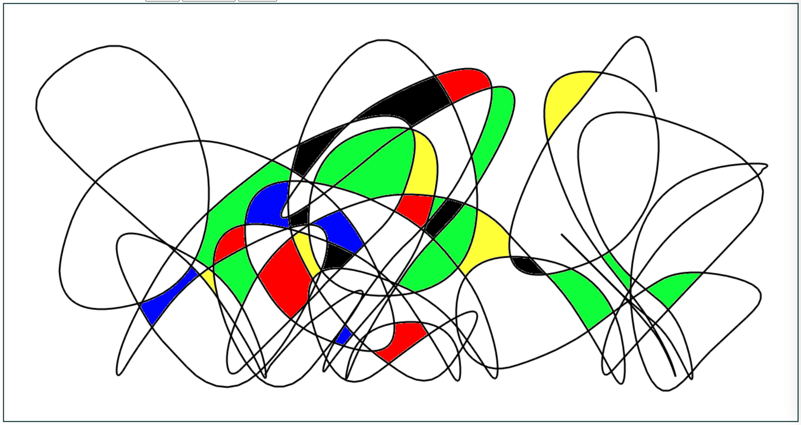
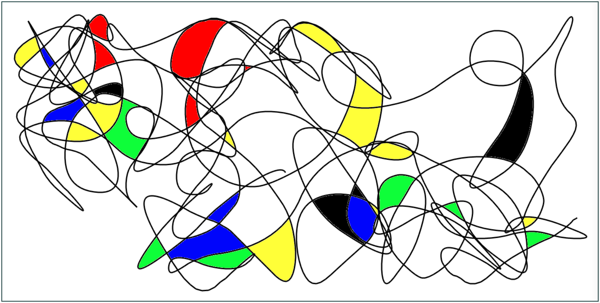

# Perpetually Drunk Mondrian
An idea that came to me from [one of my favorite fabric prints](https://www.threadless.com/shop/@threadless/design/drunk-mondrian/mens/shoes).

I originally wanted to make it a hand drawing and watercolor painting, but then I realized that the endless variety of lines calls for something more... endless. 

So here it is, hosted on GitHub Pages: https://hydralien.github.io/drunk-mondrian/

The idea is to:
- let it draw for a while (could be sped up),
- then stop drawing,
- and start painting - it'd put several random colors in random places till you stop it
- it could be done simultaneously, but the results are a bit less nice as it'd draw over colors

And here's a couple of examples:

### FWIW

Essentially it's a simple JS code that uses canvas to draw a continuous sequence of lines with a bunch of randomization in next position calculation.

It also was originally built using Parcel (so there's a bunch of leftovers from it), but it's completely unnecessary to run any node stuff in the directory, it works without it too (just opening index.html should suffice).
 